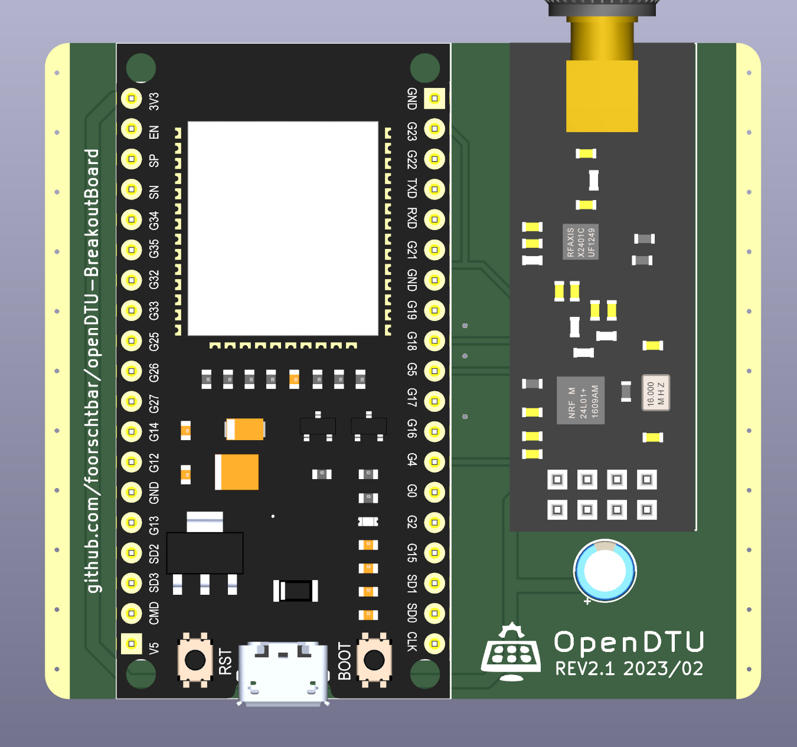
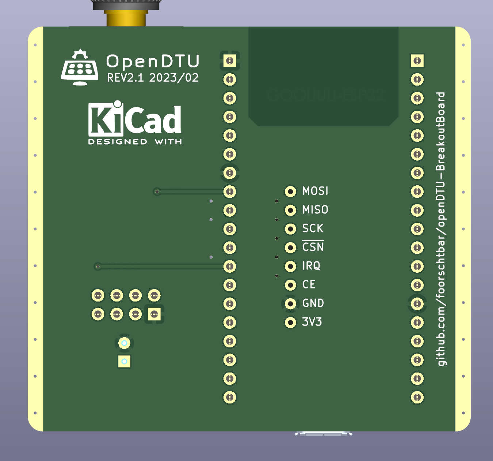

# openDTU Breakout Board

To read Hoymiles inverters there is a nice project called [openDTU](https://github.com/tbnobody/OpenDTU) which uses an ESP32 to talk to them. This is a PCB for a ESP32 (38 Pin) and a RF24L01+PA+LNA radio module. **A 3D printable case will be released soon.**

## Credits

This is a updated version. The original is from [dokuhn/openDTU-BreakoutBoard](https://github.com/dokuhn/openDTU-BreakoutBoard).
