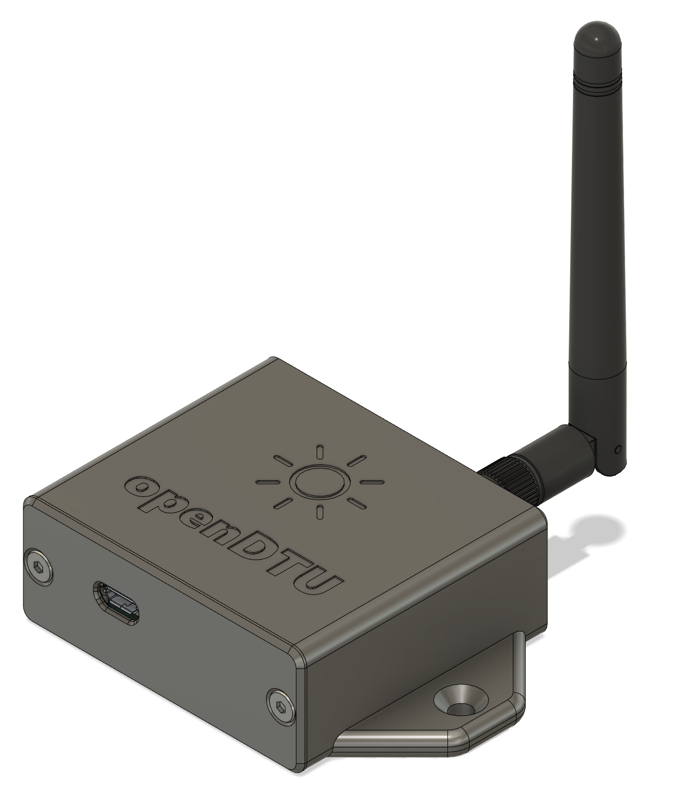
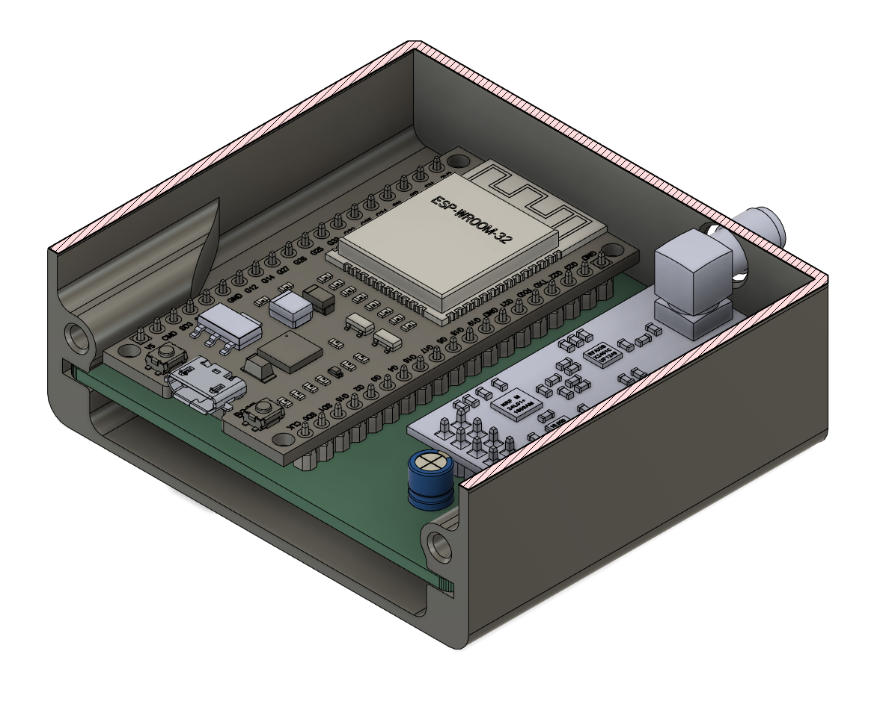

# openDTU Breakout Board

To read Hoymiles inverters there is a nice project called [openDTU](https://github.com/tbnobody/OpenDTU) which uses an ESP32 to talk to them. This is a PCB for a ESP32 (38 Pin) and a NRF24L01+PA+LNA radio module.

### PCB Ordering

:point_up: I still have a few PCBs left. If you are interested please contact me. Contact details can be found here: https://github.com/foorschtbar or visit my Tindie store:

## Case

You find the case on Printables: [Case for openDTU/ahoy Breakout Board (ESP32 and NRF24L01)](https://www.printables.com/model/421083-case-for-opendtuahoy-breakout-board-esp32-and-nrf2)

## Credits

This is a updated version. The original is from [dokuhn/openDTU-BreakoutBoard](https://github.com/dokuhn/openDTU-BreakoutBoard).
